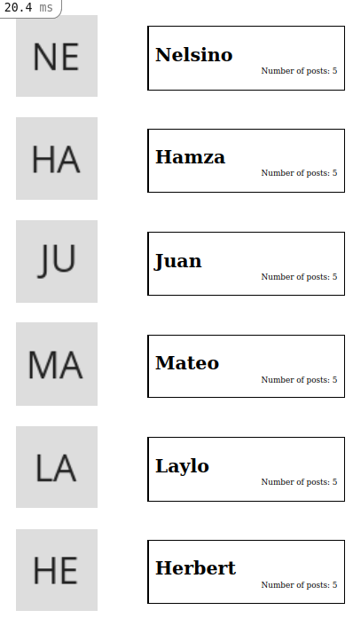

# Blog-App

> In this project we are creating a blogging app in which 
> users will be able to register and have a profile with
> posts. Each user will have a route to every single instance
> and posts list will be routed too, as well as every single post.

## Built With

- Ruby
- Rails
- JavaScript
- HTML/CSS
- Rspec

## Getting Started

To get a local copy up and running follow these simple example steps.

### Prerequisites

- Git/GitHub;
- Optional ( IDE installed in your machine ) - recommended IDE: Vscode, Rubymine;
- Ruby Installed in your machine;
- Rails gem installed in your machine;

### Setup

- To clone this repo:
  - Open the Terminal(Mac/Linux) or the Cmd (Windows);
  - Navigate to where you want to paste the Repo folder;
  - Type `git clone https://github.com/nelsinofrancisco/ror_oracle_blog.git`
  - With you preffered IDE open the folder that you cloned before
  - Run 'bundle install'
- Configuring DB access:
  - Inside the database.yml file modify the Env variables for getting the username and password to access psql database;
- Creating DB (if needed):
  - Run `rails db:create` to create a empty database for the project.
  - Run `rails db:migrate` to create database structure
  - Run `rails db:seed` to load default values into the database
  
### Run Website  

- Run `rails s` for starting the server;
- Access [http://localhost:3000/](http://localhost:3000/) to access the list of users.http://127.0.0.1:3000/users/1

## Run Tests

- Run `rails spec`.

## Authors

👤 **Juan Gonzalez**

- GitHub: [@JbirdL86](https://github.com/JbirdL86)
- Twitter: [@twitterhandle](https://twitter.com/JuanLui06498455)
- Linkedin: [linkedin](https://www.linkedin.com/in/juan-luis-0551921aa/)

## 🤝 Contributing

Contributions, issues, and feature requests are welcome!

Feel free to check the [issues page](../../issues/).

## Show your support

Give a ⭐️ if you like this project!

## Acknowledgments

- Inspiration
- Microverse

## 📝 License

This project is [MIT](./MIT.md) licensed.
